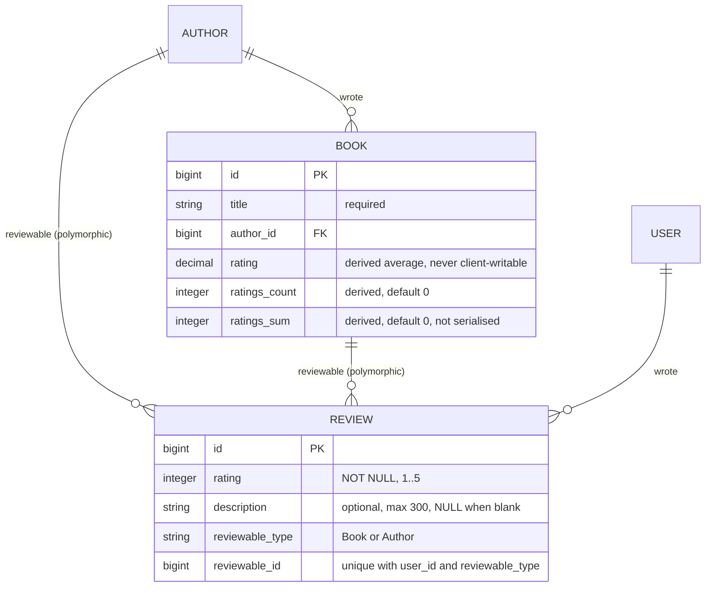
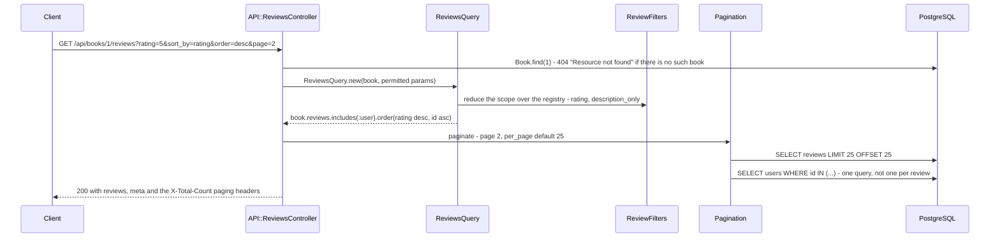

# Book Reviews

A Rails 6.1 `config.api_only` JSON API for books, authors and the reviews people
write about them, built to a take-home brief: one review per user per book, a
required 1-5 rating, an optional description, and an endpoint returning a book's
reviews with filtering and sorting. The three stretch goals — reviews of authors,
a profanity filter, an average rating per book — are implemented too. There is no
authentication: the reviewing user is whoever the request's `user_id` says it is,
which the brief asked for and which heads
[what this deliberately does not do](#what-this-deliberately-does-not-do).

## Does it do what the brief asked for?

| The brief | Where it lives |
|---|---|
| A user can review a book | `POST /api/books/:book_id/reviews` → `API::ReviewsController#create` → `CreateReview` |
| Only one review per user per book | A uniqueness validation on `Review` **and** a unique index on `(user_id, reviewable_id, reviewable_type)`. The index is the real guard: `CreateReview` rescues `RecordNotUnique` and returns the same 422 the validation would have. |
| A rating is required, 1-5 | `Review` validates presence and `inclusion: 1..5`; `reviews.rating` is `NOT NULL` |
| A description is optional | `allow_nil`, `limit: 300` in the schema, and a `before_validation` storing a blank or whitespace-only description as `NULL` |
| An endpoint returning a book's reviews | `GET /api/books/:book_id/reviews` → `ReviewsQuery` |
| …filterable | `?description_only=true`, `?rating=1..5` — `ReviewFilters::DescriptionOnly`, `ReviewFilters::Rating` |
| …sortable | `?sort_by=rating\|created_at\|updated_at&order=asc\|desc` — whitelisted in `ReviewsQuery::SORT_FIELDS`, always tie-broken on `id` |
| *Stretch:* review authors, not just books | `reviews` is polymorphic; `GET`/`POST /api/authors/:author_id/reviews` |
| *Stretch:* profanity filter | `Review#fictional_profanity`, over a deliberately fictional five-word list |
| *Stretch:* average rating per book | `books.rating`, maintained in one `UPDATE` per write by `RefreshBookRating` — see [below](#how-the-average-rating-stays-o1) |

`spec/` holds 150 examples over that, including the parts easiest to get wrong —
`spec/models/review_spec.rb` asserts every blocklisted word is rejected on its own,
and that an author review leaves the rating counters alone.

## Running it

```sh
docker compose up --build                     # API on http://localhost:8150
docker compose --profile test run --rm test   # rspec, throwaway test database
docker compose down -v                        # including the pgdata volume
```

The first command starts Postgres, creates and migrates the database, seeds
3 authors, 6 books, 5 users and 16 reviews, and serves the API — nothing else is
needed. `bin/docker-entrypoint` waits for Postgres and runs `db:prepare` and
`db:seed` before Puma starts, and the seeds are idempotent so that is safe on every
boot. `db` is published on 8151.

Without Docker: Ruby 2.7.2 (`.ruby-version`) and a local Postgres —
`config/database.yml` connects as the current OS user over the socket — then
`bundle install`, `bin/rails db:setup`, `bin/rails s`. Nothing needs configuring in
development or test; in a container it is `DATABASE_URL`, `RAILS_ENV` (the image
defaults to `production`), `RAILS_MAX_THREADS` (sizes both the Puma and Active
Record pools) and `SECRET_KEY_BASE`, which the entrypoint generates ephemerally
when unset because Rails will not boot in production without one.

## The data model



The polymorphic `reviewable` is what makes the author-review stretch goal a route
rather than a second table: `Book` and `Author` both `include Reviewable`, a
three-line concern, and one controller, query object and serializer serve both.
Only `books` carries a rating column, so `Review`'s counter hooks no-op for
author reviews. `rating`, `ratings_count` and `ratings_sum` are in no permit list
(`API::BooksController#allowed_params` takes `title`, `description`, `publish_date`,
`author_id`) and `Book` marks the counters `attr_readonly`;
`spec/requests/api/books_spec.rb` asserts a client-supplied `rating` is ignored on
both `POST` and `PUT`.

## Serving a book's reviews



Every parameter on that URL is untrusted and none of it reaches SQL as text.
`sort_by` and `order` are looked up in frozen hashes, so an injected column name
is simply not found and the default `id` ordering applies. A `?rating=` that is
non-numeric or outside 1-5 is ignored rather than rejected — a filter is a
refinement, not a command. `?page=-3&per_page=100000` clamps to page 1 and 100 per
page (`Pagination::MAX_PER_PAGE`), and `Pagination#total` counts the filtered
scope with `includes` and `order` stripped, so the total belongs to the filter
rather than the page.

Because every review renders its reviewer's name, `ReviewsQuery` eager loads
`:user`, and `spec/queries/reviews_query_spec.rb` has an example named *"only issues
one query for the users of a page of reviews"* that subscribes to `sql.active_record`
notifications and counts them, so that cannot silently regress into an N+1.

## How the average rating stays O(1)

The obvious way to keep `books.rating` correct is `AVG(rating)` over the book's
reviews after every write, which makes the most-reviewed book the slowest one to
review. Instead `books` carries `ratings_count` and `ratings_sum` as exact integers
and `RefreshBookRating.apply_delta` applies a signed delta to both in one statement
that derives the average in the same breath:

```sql
UPDATE books
SET ratings_count = books.ratings_count + ?,
    ratings_sum   = books.ratings_sum + ?,
    rating = CASE WHEN books.ratings_count + ? > 0
             THEN (books.ratings_sum + ?)::decimal / (books.ratings_count + ?)
             ELSE NULL END
WHERE id = ?
```

`Review`'s `after_create`, `after_update` (only when the rating changed) and
`after_destroy` hooks call it, so the API, the seeds, a console session and a
cascading user delete all keep the counters correct. Because the sum is an integer
the average cannot drift the way folding each rating into a stored average does, as
`review_spec.rb` shows. Denormalised data needs a repair path, so
`RefreshBookRating.recalculate!` is exposed as `rails ratings:recalculate`.

Reads lean on two composite indexes added in
`db/migrate/20260923090100_add_filter_and_sort_indexes_to_reviews.rb`:
`(reviewable_type, reviewable_id, rating, id)` and
`(reviewable_type, reviewable_id, created_at, id)`. Both lead with the reviewable,
so narrowing to one book and then filtering or sorting comes from the index rather
than from sorting that book's rows, and `id` is in each because the query object
always appends it as the tie-breaker. The same migration drops the older
`(reviewable_type, reviewable_id)` index: a strict prefix of both new ones, so it
could serve nothing they cannot while every insert paid to maintain it. `updated_at`
sorting is deliberately uncovered — a third index on the write path for a sort
nobody asked for.

One wire-format detail belongs here. `books.rating` is an unconstrained `numeric`,
which Rails renders as a JSON **string** of every digit Postgres produced — book
1's ratings of 5, 4 and 5 would go out as `"4.6666666666666667"`. The wire format
is the serializer's decision, not the column type's, so `BookSerializer` rounds to
two places and emits a JSON number (`4.67`, or `null` for an unreviewed book) and
publishes `ratings_count` but not `ratings_sum`, which is an implementation
detail. `spec/serializers/serializers_spec.rb` pins it.

## Adding a filter

`ReviewFilters` is a registry, and a filter is any object with `#param_name` and
`#apply(scope, value)`:

```ruby
class MinimumRating
  def param_name
    :min_rating
  end

  def apply(scope, value)
    value.present? ? scope.where('reviews.rating >= ?', value.to_i) : scope
  end
end
ReviewFilters.register(MinimumRating.new)
```

`?min_rating=4` now works on the book *and* author reviews endpoints.
`ReviewsQuery` reduces the scope over the registry and the controller permits
`ReviewFilters.param_names`, so neither changes; `register` raises unless the
object implements both methods, and `reset!` restores the built-ins for tests.
`spec/queries/reviews_query_spec.rb` registers one at runtime and asserts it takes
effect, and rejects a malformed one. It is the seam worth having: "can I also
filter by date range, by user, by minimum rating" is the next request in every
version of this brief.

## The rest of the surface

`GET`/`POST` on `/api/books`, `/api/authors`, `/api/users` and the two nested
`.../reviews`, `GET`/`PUT`/`PATCH` on each `/api/<resource>/:id`, plus `/health`.
Creating a review takes `user_id` (required, must exist), `rating` (required, 1-5)
and `description` (optional, max 300), and succeeds with
`201 {"message": "success"}` — the brief's response, kept as-is. Every non-2xx
under `/api` has one shape, `{"errors": ["…"]}`, from one place in
`ApplicationController`: `400` for a missing parameter, `404` for
`{"errors": ["Resource not found"]}`, `422` for a rejected validation. A client
needs one branch rather than one per status code, and
`spec/requests/api/error_contract_spec.rb` holds it to that. `/health` is the
documented exception, being a probe and not a resource (also why it sits outside
`/api`): `{"status":"ok","database":"ok"}`, or `503` naming the exception class when
Postgres is unreachable.

## Tests, linter and captured output

```sh
bundle exec rspec                 # or: docker compose --profile test run --rm test
bundle exec rubocop               # .rubocop.yml, with rubocop-rails and rubocop-rspec
bin/rails ratings:recalculate     # rebuild the rating counters from the reviews
```

Examples run in transactions, and `Gemfile.lock` records `arm64-darwin`,
`x86_64-darwin-19`, `x86_64-linux` and `aarch64-linux`, so Bundler needs no added
platform on Apple Silicon or in the container — but Ruby 2.7.2 is old enough that a
host gem set can drift, so Compose is the reproducible way to run the suite.

There is no user interface to screenshot.
[`docs/captured-output.md`](docs/captured-output.md) is the substitute: seventeen
real request/response pairs captured against the seeded Compose stack — paging
headers, filter and sort combinations, the average moving inside a single write, the
duplicate, out-of-range and profanity rejections, the 404 for an unknown book,
`?page=-3&per_page=100000` clamped, and `?sort_by=id;DROP TABLE reviews` falling
back to `id` ordering with the table intact — plus the boot log and the recorded
`rspec` (150 examples, 0 failures) and `rubocop` runs.

## What this deliberately does not do

* **No authentication or authorisation.** Any client can review as any `user_id`;
  in production it would come from a token. No rate limiting either.
* **No update or delete route for a review**, though the model and the counters
  handle both correctly and are specced. The brief asked for creation and listing.
* **The profanity filter is a five-word fictional blocklist** on word boundaries. It
  shows where the check belongs, not how to moderate content at scale.
* **Pagination is limit/offset**, which degrades at deep offsets — a keyset cursor
  (`WHERE id > :last_id`) is the next step.
* **`books.rating` is denormalised.** It is written in the same transaction as the
  review that changes it and there is a repair task, but a direct `UPDATE` can still
  corrupt it. Author reviews have no average at all, because only `books` has a
  rating column — which is what the brief described.
* **No caching, no background jobs, no AI, nothing beyond the brief.** The only
  endpoint outside it is `GET /health`. Ruby 2.7.2 and Rails 6.1 are out of upstream
  support and kept anyway: the repo is a record of the exercise as submitted, and an
  upgrade would make the diff about the upgrade.
